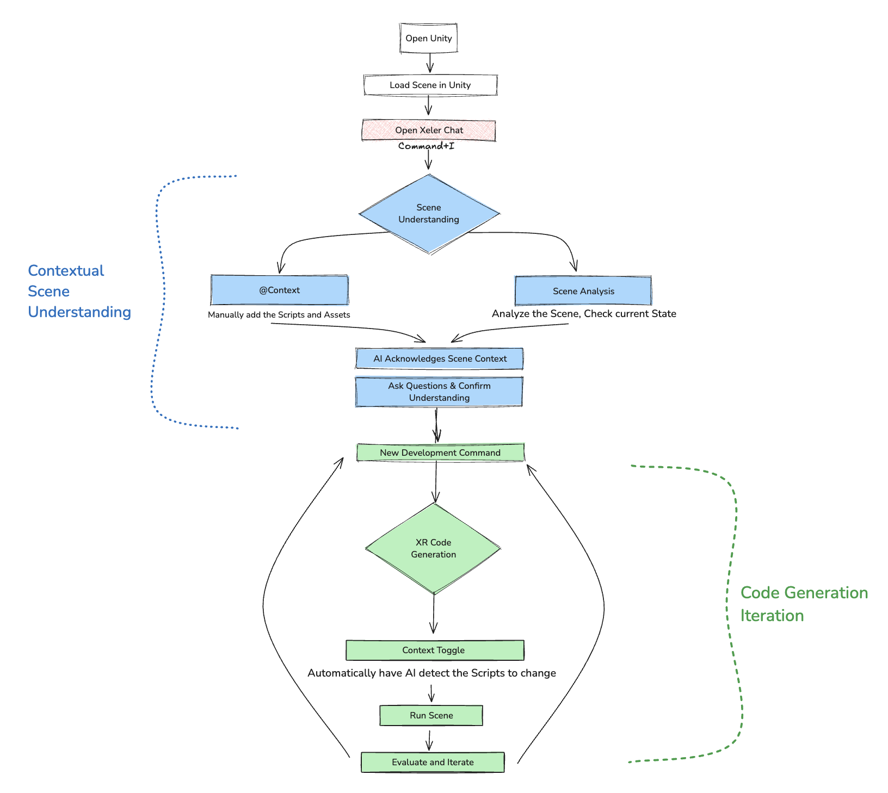

# Protocol (Previously XeleR) : Accelerating XR Prototyping

## Overview

This repository is a proof of concept for our product Protocol.

## Overview

This Unity Editor extension is a core component of the XeleR platform—a Text2XR solution designed to transform the XR app development ecosystem. XeleR aims to provide rapid, AI-assisted XR prototyping that lowers development barriers, accelerates iteration cycles, and ensures cross-platform compatibility. This project delivers a real-time chatbot window integrated into the Unity Editor, enabling developers to receive streaming AI responses, automated code suggestions, scene analysis, and file browsing capabilities.

For detailed technical documentation of the codebase, please refer to the [documentation.md](./documentation.md) file. This document provides in-depth explanations of the system architecture, implementations, and extension points to help developers understand and contribute to the project.

## Demo Video

https://github.com/user-attachments/assets/bb95c530-e651-458b-8472-399034f92120

## XeleR Interface Explanation

**Context & Scene Analysis:**

- **@ Context Button:**  
  - This button allows you to include relevant project details when making requests.  
  - If you’ve loaded a script or scene, activating this ensures that the chatbot considers the current project state when generating responses.  
  - *Use this for fine control over what context the AI receives.*

- **Scene Analysis Button:**  
  - Clicking this button generates a structural overview of your current Unity scene.  
  - It lists all GameObjects (e.g., robotic arm, conveyor belt, control panel) and identifies missing or problematic components (e.g., "The robotic arm has no Collider, which may cause interaction issues").  
  - **Best Used For:**  
    - Obtaining a scene overview before deciding what to change.  
    - Spotting missing components or potential issues.

- **Quick Context Toggle:**  
  - Enabling this checkbox allows the chatbot to automatically include scene context in all queries.  
  - **Without Quick Context Enabled (@ Context Only):**  
    - You must manually select scripts or assets; AI only considers the specific files you choose.  
  - **With Quick Context Enabled:**  
    - The AI automatically detects relevant scripts and scene data based on what’s actively used in the project.  
    - This is ideal for iterative development, where frequent updates are made without reconfiguring context each time.


## XeleR Framework

Below is a high-level diagram of how XeleR’s chatbot fits into your Unity workflow:



1. **Open Unity & Load Scene**  
   You begin by opening your Unity project and loading the desired scene.
2. **Open XeleR Chat**  
   Launch the XeleR Chat window (docked in the Editor). The system analyzes your current scene and is ready to provide AI-driven assistance.
3. **Scene Understanding**  
   - Use the `@Context` button or scene analysis features to include your scene’s scripts and assets in the AI’s context.
   - The AI acknowledges the scene context and can answer questions or confirm understanding before code generation.
4. **New Development Command**  
   - Send commands or prompts to generate new code, modify scene objects, or integrate new assets.
   - The chatbot automatically detects relevant scripts to change or create.
5. **Code Generation Iteration**  
   - The AI provides code suggestions or direct file edits.
   - You can run, review, and iterate on these changes in the Unity Editor, quickly testing your XR experience.


## Features

- **Unity Integrated Real-Time Chat Interface:**  
  Provides a dockable chat window within Unity that streams AI responses in real time using Unity's UIElements.

- **Scene Analysis & Debugging:**  
  Extracts scene context and applies modifications via reflection, helping developers quickly iterate on scene design and interactions. So you no longer have to explain things within the scene anymore

- **File & Scene Browsing:**  
  Integrates file browsing functionality to load scripts or scenes, incorporating them into AI queries for context-aware responses.

  ---

## Installation & Setup

1. **Add the Script Files**  
   - Clone or download this repository.  
   - To run this project: Open Unity Hub and add this repository as a project with Unity version 2022.3.11f1.
   - To use XeleR in your existing project: Place the script files into an `Editor` folder within your Unity project. Unity will automatically compile them as part of its editor extension workflow.

2. **Configure API Keys**  
   - In the Unity menu, go to **Window → Chatbox** to open the XeleR Chat window.  
   - Click the **API Settings** button to enter your OpenAI and/or Claude API keys.  
   - These keys are securely stored using Unity’s `EditorPrefs`.

3. **Load the Extension**  
   - Once the scripts are in place and Unity finishes compiling, the Chatbox should appear docked (or open it manually if needed).  
   - If it doesn’t appear automatically, use **Window → Chatbox** to open it.


## Usage

1. **Analyze the Scene**  
   - Load the desired Unity scene.  
   - In the Chat window, click `@Context` to browse scripts or scenes and add them to the AI context.  
   - Optionally, enable the **scene analysis** features to allow the AI to examine objects and hierarchy in the current scene.

2. **Start Generating Code**  
   - Type your query or command in the chat input. For example:  
     *"Create a new GameObject called ‘PlayerAvatar’ and attach a CharacterController."*  
   - The chatbot will respond with code snippets or scene modifications.  
   - When code is suggested in a specific format (e.g., ```csharp:Assets/Scripts/SomeFile.cs```), the system can automatically apply these changes to your project.

3. **Iterate & Refine**  
   - Press **Play** in Unity to test changes.  
   - Return to the Chat window to further refine or debug your XR experience.  
   - Repeat the process until you reach a satisfactory prototype.

4. **Session Management**  
   - Create multiple chat sessions for different projects or prototypes.  
   - Switch sessions to load previous conversation histories, code references, and scene contexts.  
   - All data is stored in `EditorPrefs`, so sessions persist across Unity restarts.

---

**Key Benefits:**

- **Text-to-XR Prototyping:**  
  Transform plain-text descriptions into interactive XR prototypes, making early-stage development faster and more accessible.

- **Agent Mode: Scene Edit Application:**  
  XeleR can automatically apply changes and edits to the scene. It goes through an approval system similar to how Cursor works. 

- **AI-Powered Debugging & Automation:**  
  Automate debugging and testing processes, reducing manual effort and accelerating iteration cycles.

- **Cross-Platform Compatibility:**  
  Develop once and deploy across multiple XR devices seamlessly, ensuring broad reach and flexibility.

## Sample Scripts
You can try one of our sample scripts generated using XeleR. The scripts are in Assets>Scripts>Sample Scripts. We currently have DuplicatePlayerOnStart.cs which duplicates the player in the GameScene on start.

